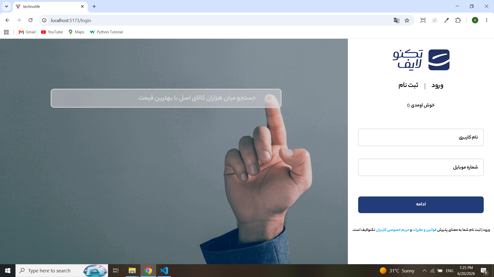
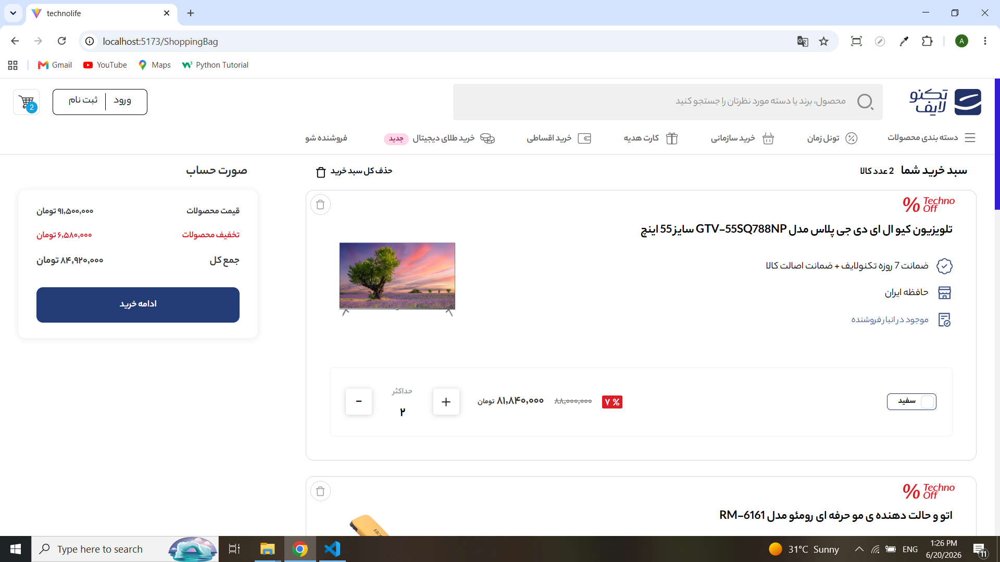

# فروشگاه آنلاین با JSON Server فیک

این پروژه یک **فروشگاه آنلاین** است که با استفاده از **JSON Server فیک** برای توسعه بک‌اند ساخته شده است.

>  توجه: به دلیل محدودیت‌های JSON Server و نبود دیتای واقعی، فقط برخی از ویژگی‌ها توسعه داده شده‌اند.

---

## ویژگی‌ها

- **صفحه محصولات**: نمایش لیست محصولات با جزئیات.
- **سبد خرید**: اضافه کردن و مدیریت محصولات در سبد.
- **کامنت‌ها**: ثبت کامنت برای هر محصول. 
  > 💡 توجه: پس از ثبت کامنت، صفحه را **رفرش** کنید تا کامنت شما نمایش داده شود.

---

## محدودیت‌ها

- داده‌ها واقعی نیستند و همه چیز روی **JSON Server فیک** کار می‌کند.
- برخی فیچرها به دلیل محدودیت بک‌اند تکمیل نشده‌اند.

---

## نصب و اجرا

1. پروژه را کلون کنید:
   ```bash
   git clone <آدرس پروژه>

2. وابستگی‌ها را نصب کنید:
    npm install   

3. JSON Server را راه‌اندازی کنید:
    npx json-server --watch db.json --port 3001

4. پروژه را اجرا کنید:
    npm start 

## تصاویر

.png)
.png)
.png)

.png)
.png)
.png)


## ویديو
[مشاهده دمو در یوتیوب](https://youtu.be/sDRIz3osyXI)